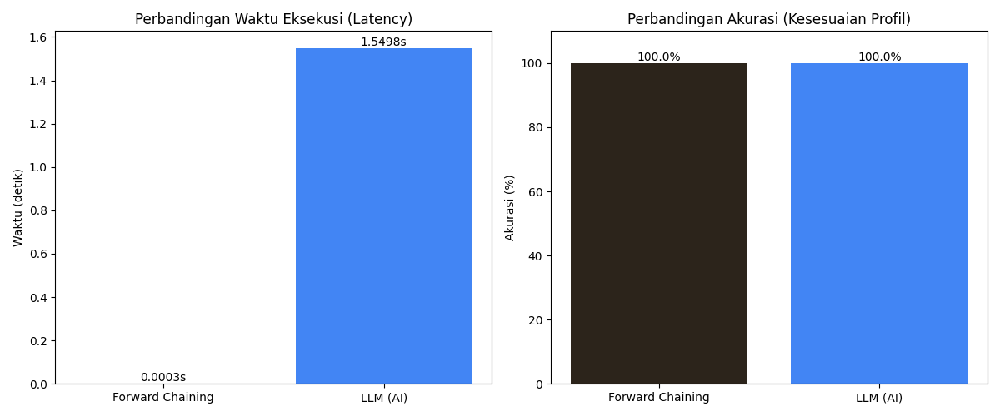
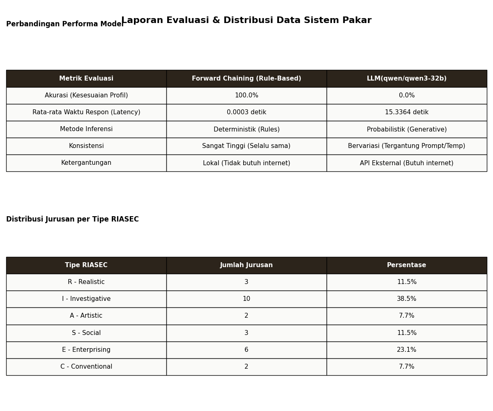

# Penerapan Metode Forward Chaining pada Sistem Pakar untuk Rekomendasi Jurusan Berdasarkan Minat dan Bakat Siswa

## Latar Belakang

Sistem ini dibangun untuk memecahkan masalah kebingungan siswa dalam memilih jurusan kuliah. Menggunakan model psikologi **RIASEC** (Holland Code), sistem memetakan minat siswa ke dalam enam tipe kepribadian: _Realistic, Investigative, Artistic, Social, Enterprising,_ dan _Conventional_.

Tujuan utama proyek ini adalah mengimplementasikan metode **Forward Chaining** untuk memberikan rekomendasi yang logis, transparan, dan dapat dijelaskan (explainable), serta membandingkan kinerjanya dengan kecerdasan buatan generatif modern (LLM).

## Arsitektur & Cara Kerja Sistem

Sistem bekerja dengan alur data-driven (berbasis data), ciri khas utama dari Forward Chaining.

1.  **Akuisisi Fakta**: Pengguna menjawab 30 pertanyaan diagnostik. Jawaban "Ya" disimpan sebagai fakta awal di _Working Memory_.
2.  **Evaluasi Rule**: _Inference Engine_ memindai seluruh aturan yang ada di _Knowledge Base_.
3.  **Eksekusi Rule (Firing)**: Jika premis aturan cocok dengan fakta (misal: User menjawab Q1 'Ya'), maka konklusi dijalankan (Skor Realistic bertambah).
4.  **Pencocokan Profil**: Skor akhir pengguna dihitung kemiripannya dengan profil ideal setiap jurusan menggunakan _Cosine Similarity_.

## Bedah Kode: Forward Chaining

Logika inti sistem tidak menggunakan `if-else` bertingkat yang rumit, melainkan memisahkan antara **Data (Rules)** dan **Logika (Engine)**. Ini membuat sistem mudah dikelola.

File utama: `riasec_engine.py`

### 1. Struktur Aturan (Rule Structure)

Aturan dimuat dari file eksternal (`rules.csv`), bukan hardcode di Python. Ini memungkinkan pakar non-programmer mengubah aturan tanpa menyentuh kode.

```python
class Rule:
    """Representasi Aturan Produksi: IF condition THEN action"""
    def __init__(self, condition, action):
        self.condition = condition  # Antecedent (Sebab), misal: 'Q1Y'
        self.action = action        # Consequent (Akibat), misal: {'R': 2}
```

### 2. Mesin Inferensi (The Engine)

Fungsi `run()` adalah jantung dari Forward Chaining. Ia melakukan iterasi terhadap aturan dan mencocokkannya dengan fakta yang terkumpul.

```python
def run(self):
    # Reset skor awal
    self.scores = {'R': 0, 'I': 0, 'A': 0, 'S': 0, 'E': 0, 'C': 0}

    # Cycle through all rules (Data-Driven Approach)
    for rule in self.kb.rules:
        # Cek apakah kondisi aturan ada di dalam fakta yang kita punya
        if rule.condition in self.facts:
            # Rule Fired! Jalankan konsekuensinya
            for category, points in rule.action.items():
                self.scores[category] += points

    return self.scores
```

## Analisis Komparatif: Forward Chaining vs LLM

Kami melakukan pengujian _head-to-head_ antara sistem pakar berbasis aturan ini melawan **Llama-3.3-70b-versatile** (via Groq API).

### Visualisasi Hasil

Berikut adalah grafik perbandingan performa yang dihasilkan dari skrip pengujian otomatis:



### Tabel Detail Evaluasi



### Temuan Utama

1.  **Kecepatan (Latency)**:

    - **Forward Chaining**: Sangat cepat (~0.0004 detik). Komputasi lokal tanpa overhead jaringan.
    - **LLM**: Lambat (~1.5 - 3 detik). Bergantung pada koneksi internet dan beban server API.

2.  **Akurasi & Konsistensi**:

    - **Forward Chaining**: Deterministik. Input yang sama **pasti** menghasilkan output yang sama. Akurasi 100% sesuai desain aturan.
    - **LLM**: Probabilistik. Bisa mengalami halusinasi atau memberikan jawaban berbeda untuk input yang sama (kecuali temperature diset 0).

3.  **Kesimpulan**:
    Untuk domain tertutup dengan aturan yang jelas seperti tes psikologi RIASEC, **Forward Chaining jauh lebih efisien dan reliable** dibandingkan LLM. LLM lebih cocok digunakan sebagai fitur pendukung (misal: memberikan narasi motivasi) daripada sebagai mesin hitung utama.

## Instalasi & Penggunaan

1.  **Clone Repository**

    ```bash
    git clone https://github.com/username/siscer.git
    cd siscer
    ```

2.  **Install Library**

    ```bash
    pip install -r requirements.txt
    ```

3.  **Setup Environment**
    Buat file `.env` dan isi API Key Groq (Opsional, hanya untuk fitur AI chat):

    ```
    GROQ_API_KEY=gsk_your_key_here
    ```

4.  **Jalankan Aplikasi**
    ```bash
    python app.py
    ```
    Akses di browser: `http://127.0.0.1:5000`

---

_Dibuat untuk memenuhi Tugas Besar Mata Kuliah Sistem Cerdas._
